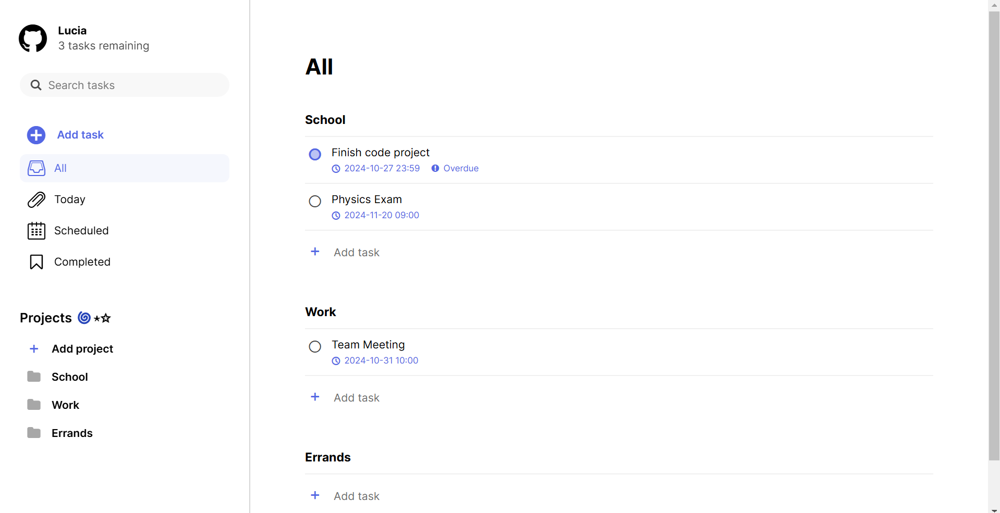

# To-do List

The Odin Project - JavaScript Course Project 4:

A To-do List application built using HTML, CSS and JavaScript.

The project used Webpack for module bundling, as well as the date-fns library for date manipulation/formatting.

User data was managed using the Web Storage API (localStorage), allowing users to maintain their data even after refreshing the page.

## Preview

## Links

Live Link: https://luciavu.github.io/todo-list/

Assignment: https://www.theodinproject.com/lessons/node-path-javascript-todo-list

## Credits

Icons from Fontello: https://fontello.com/
